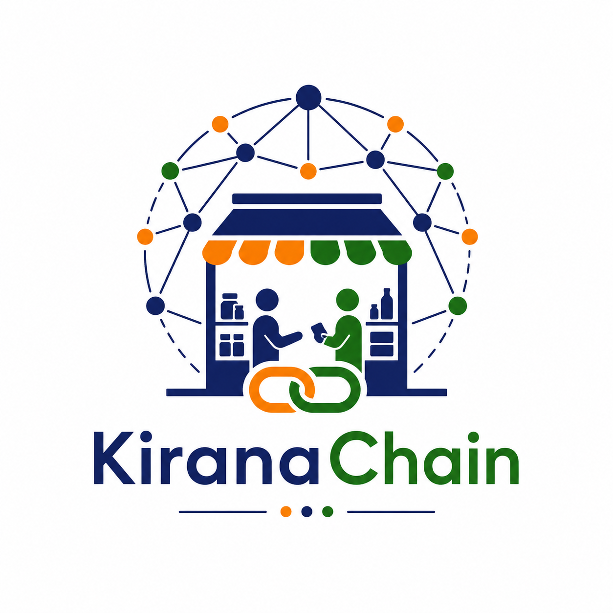

<p align="center">
  
</p>

<h1 align="center">KiranaChain</h1>

<p align="center">
<b>High-Fidelity Decentralized Retail Negotiation Telemetry Dataset</b>
</p>

<p align="center">
Large-Scale Multi-Agent Negotiation Trajectories for India's Informal Retail Economy
</p>

<p align="center">

[](LICENSE)
[]()
[]()
[]()
[]()
[]()
[]()
[]()

</p>

---


A benchmark dataset containing **1,000,000 negotiation-turn records**, **125,000 complete trajectories**, multilingual bargaining dialogue, informal credit (**Udhar**) dynamics, and supply-chain intelligence signals — engineered for **Reinforcement Learning**, **Multi-Agent Systems**, **Graph Learning**, **Credit Risk Modeling**, and **Conversational AI** research.

---

## Why KiranaChain?

| | |
|--|--|
| ✅ 1,000,000 negotiation-turn records | ✅ 125,000 complete trajectories |
| ✅ 40 structured variables | ✅ Informal Credit (Udhar) modeling |
| ✅ Multilingual Hinglish / Telugu-English dialogue | ✅ Reinforcement Learning ready |
| ✅ Graph Learning ready | ✅ Supply-chain intelligence benchmark |
| ✅ Fully reproducible generation pipeline | ✅ Apache Parquet — Snappy compressed |

---

## Overview

India's Kirana retail sector comprises an estimated 12–14 million independently operated micro-retail establishments, forming one of the world's largest informal retail ecosystems. Supported by a vast network of regional wholesale distributors and Agricultural Produce Market Committees (APMCs), this ecosystem operates through highly localized, relationship-driven transactions governed by informal credit arrangements, perishable logistics constraints, regional supply volatility, and multilingual bargaining behaviors.

Despite its scale and economic significance, the operational dynamics of this network — particularly negotiation behavior, Udhar credit relationships, and distributor–retailer interactions — remain absent from publicly available structured datasets. KiranaChain addresses this gap by providing a large-scale, trajectory-structured behavioral dataset encoding bilateral distributor–Kirana negotiations across 12 Indian states. Each of the 125,000 negotiation episodes spans 8 sequential turns, capturing price evolution, posture transitions, informal credit states, environmental externalities, and code-switched dialogue within a unified 40-feature observation space.

---

## Dataset Overview

<p align="center">
  
</p>
<p align="center">
  <b>KiranaChain — Financial & Credit Dependency Structure (Realized Pearson Correlation Matrix)</b>
</p>

---

## Key Statistics

| Metric | Value |
|--------|-------|
| Total Rows | 1,000,000 |
| Total Trajectories | 125,000 |
| Turns per Trajectory | 8 (fixed) |
| Total Features | 40 |
| Settlement Rate | 61.23% |
| Walk-Away Rate | 20.47% |
| Credit-Denial Rate | 2.76% |
| Mean Distributor Ask Price | ₹85.50 / unit |
| Mean Settled Price | ₹75.63 / unit |
| Trust Score ↔ Default Risk (Pearson r) | −0.8429 |
| Dataset Size (Snappy compressed) | ~156 MB |
| Generation Runtime (Colab CPU) | ~128 seconds |

---

## Dataset Splits

| Split | File | Rows | Trajectories | Share |
|-------|------|------|-------------|-------|
| Train | `kiranachain_v1_train.parquet` | 800,000 | 100,000 | 80% |
| Validation | `kiranachain_v1_val.parquet` | 100,000 | 12,500 | 10% |
| Test | `kiranachain_v1_test.parquet` | 100,000 | 12,500 | 10% |

Splits are partitioned at the **trajectory level**. Zero `trajectory_id` overlap verified across all three partitions. Turn-level leakage is structurally impossible.

---

## Feature Blocks

| Block | Columns | Description |
|-------|---------|-------------|
| Agent Profiles & Geographics | 1–8 | Agent identifiers, geographic tier, state context, commodity category |
| Financial & Credit Matrix | 9–18 | Trust score, Udhar balance, liquidity stress, default risk, repayment velocity |
| Environmental & Supply Chain | 19–28 | Monsoon index, festival proximity, inflation, perishability, bottleneck type |
| Negotiation Trajectory & Dialogue | 29–40 | Price paths, posture, settlement status, Hinglish dialogue, JSON telemetry, GP noise |

---

## Documentation

| File | Purpose |
|------|---------|
| [`documentation/dataset_card.md`](documentation/dataset_card.md) | Dataset overview, development team, statistics, and applications |
| [`documentation/data_dictionary.md`](documentation/data_dictionary.md) | Complete 40-column schema — type, valid range, observed range, descriptions |
| [`documentation/methodology.md`](documentation/methodology.md) | 12-stage generation pipeline — copula, Markov chain, GP noise specifications |
| [`documentation/limitations.md`](documentation/limitations.md) | Modeling assumptions, scope boundaries, and known constraints |

---

## Generation Architecture

KiranaChain is produced through a 12-stage procedural simulation pipeline:

```
Agent Instantiation → Financial Copula → Environmental Copula → Price Initialization
         ↓
Markov Negotiation Engine → Price Concession Walk → Gaussian Process Noise
         ↓
Posture Assignment → Dialogue Generation → Sentiment Scoring
         ↓
       Parquet Streaming Output → Validation & QA
```

**Core modeling components:**

- **Gaussian Copula** — structured non-linear inter-variable dependency modeling across financial and environmental feature blocks via Cholesky-decomposed correlation matrices, preserving realistic cross-variable relationships while allowing heterogeneous marginal distributions
- **Non-Stationary Markov Chain** — turn-conditioned and stress-conditioned transition probability matrices governing settlement, walk-away, and credit-denial state resolution with absorbing terminal states
- **Gaussian Process Noise** — squared-exponential kernel (l = 5.0) injecting temporally autocorrelated behavioral perturbation into price trajectories, reproducing within-episode human irrationality patterns

Full mathematical specification: [`documentation/methodology.md`](documentation/methodology.md)

---

## Exploratory Data Analysis

<table>
<tr>
<td></td>
<td></td>

</tr>
<tr>
<td></td>
<td></td>
</tr>
<tr>
<td></td>
<td></td>
</tr>
<tr>
<td></td>
<td></td>
</tr>
</table>

---

## Correlation Validation

| Variable Pair | Realized Pearson r | Design Target |
|--------------|-------------------|--------------|
| Trust Score ↔ Default Risk | −0.8429 | ≈ −0.78 |
| Liquidity Stress ↔ Default Risk | +0.85 | ≈ +0.85 |
| Trust Score ↔ Credit Limit | +0.82 | ≈ +0.82 |
| Monsoon Index ↔ Perishability | +0.66 | ≈ +0.66 |

---
## Quick Start

### Load the Dataset

```python
import pandas as pd

# Load KiranaChain
df = pd.read_parquet("kiranachain_v1.parquet")

print("Dataset Shape:", df.shape)
```

Expected Output:

```text
Dataset Shape: (1000000, 40)
```

---

### Inspect Available Features

```python
print(df.columns.tolist())
```

This returns all 40 dataset features, including financial, environmental, negotiation, and dialogue variables.

---

### View Sample Records

```python
df.head()
```

Preview the first few negotiation-turn records and inspect the schema structure.

---

### Explore a Complete Negotiation Trajectory

Each negotiation episode contains 8 sequential turns linked by a common `trajectory_id`.

```python
trajectory_id = df["trajectory_id"].iloc[0]

trajectory = (
    df[df["trajectory_id"] == trajectory_id]
    .sort_values("turn_number")
)

print(
    trajectory[
        [
            "turn_number",
            "current_turn_offer_price",
            "negotiation_posture",
            "settlement_status"
        ]
    ]
)
```

Example Output:

```text
   turn_number  current_turn_offer_price negotiation_posture settlement_status
0            1                     82.40           Defensive       In-Progress
1            2                     80.15           Defensive       In-Progress
2            3                     78.92         Cooperative       In-Progress
3            4                     77.51         Cooperative           Settled
```

---

### Inspect Negotiation Dialogue

```python
print(
    trajectory[
        [
            "turn_number",
            "code_switched_dialogue_raw"
        ]
    ]
)
```

Example Output:

```text
Turn 1 : Sir ₹82 rate lo ivvandi.
Turn 2 : Konchem tagginchandi, margin chala takkuva undi.
Turn 3 : Sare ₹79 final offer.
Turn 4 : Deal confirmed.
```

---

### Settlement Outcome Distribution

```python
(
    df["settlement_status"]
    .value_counts(normalize=True)
    .mul(100)
    .round(2)
)
```

Example Output:

```text
Settled          61.23%
Walked-Away      20.47%
In-Progress      15.54%
Credit-Denied     2.76%
```

---

### Count Negotiation Episodes

```python
print(
    "Total Trajectories:",
    df["trajectory_id"].nunique()
)
```

Expected Output:

```text
Total Trajectories: 125000
```

---

### Load Official Train / Validation / Test Splits

```python
train = pd.read_parquet("kiranachain_v1_train.parquet")
val   = pd.read_parquet("kiranachain_v1_val.parquet")
test  = pd.read_parquet("kiranachain_v1_test.parquet")

print("Train:", train.shape)
print("Validation:", val.shape)
print("Test:", test.shape)
```

Expected Output:

```text
Train:      (800000, 40)
Validation: (100000, 40)
Test:       (100000, 40)
```

---

## Research Applications

| Research Area | Representative Tasks |
|--------------|---------------------|
| Reinforcement Learning | Offline RL, negotiation policy optimization, reward modeling |
| Supervised Learning | Settlement prediction, price forecasting, posture classification |
| Credit Risk Modeling | Udhar default estimation, trust-score learning, informal credit analysis |
| NLP & Large Language Models | Code-switched dialogue generation, instruction tuning, dialogue act tagging |
| Supply Chain Intelligence | Bottleneck forecasting, disruption impact modeling, demand-shock analysis |
| Graph Machine Learning | Distributor–retailer trust network analysis, credit propagation modeling |
| Behavioral Economics | Decision modeling under liquidity stress and resource constraints |
| Sequence & Trajectory Modeling | Price path forecasting, negotiation convergence, state transition prediction |

---

## Intended Research Domains

- Reinforcement Learning & Offline Policy Optimization
- Multi-Agent Systems & Strategic Interaction Modeling
- Agentic AI & Autonomous Negotiation
- Informal Credit & Microfinance Risk Modeling
- Supply Chain Intelligence & Resilience Analytics
- Behavioral Economics & Decision Science
- Code-Switched & Multilingual NLP
- Graph Neural Networks & Relational Learning
- Time-Series Forecasting & Sequential Modeling
- Decision Intelligence Under Uncertainty

---

## Validation Summary

| Check | Status |
|-------|--------|
| Dataset Shape (1,000,000 × 40) | ✅ Passed |
| Zero Unexpected Null Values | ✅ Passed |
| Trajectory Integrity (125,000 × 8 turns) | ✅ Passed |
| Schema Compliance | ✅ Passed |
| Correlation Structure Verification | ✅ Passed |
| Train / Val / Test Leakage Check | ✅ Passed |
| Distribution Consistency | ✅ Passed |

---

## Repository Structure

```
KiranaChain/
│
├── data/
│   ├── kiranachain_v1.parquet               # Full dataset — 1,000,000 rows × 40 features
│   ├── kiranachain_v1_train.parquet         # Train split  — 800,000 rows, 100,000 trajectories
│   ├── kiranachain_v1_val.parquet           # Val split    — 100,000 rows,  12,500 trajectories
│   └── kiranachain_v1_test.parquet          # Test split   — 100,000 rows,  12,500 trajectories
│
├── schema/
│   └── kiranachain_v1_schema.json           # JSON Schema for llguidance_constrained_json_log
│
├── notebooks/
│   └── kiranachain_generator.ipynb          # Complete dataset generation pipeline
│
├── documentation/
│   ├── dataset_card.md
│   ├── data_dictionary.md
│   ├── methodology.md
│   └── limitations.md
│
├── Plots/                                   # EDA visualizations 
│
├── LICENSE                                  # MIT License
├── CITATION.cff                             # GitHub citation metadata
└── README.md
```

---

## Citation

```bibtex
@dataset{kiranachain2026,
  title     = {KiranaChain: Multi-Agent Decentralized Retail Negotiation Trajectories},
  author    = {Dhadi, Sai Praneeth Reddy and Mididuddi, Dhatri and
               Biradar, Amulya and Reddy, M. Jithender},
  year      = {2026},
  version   = {1.0.0},
  publisher = {Atlas AI Labs},
  url       = {https://github.com/dspraneeth07/KiranaChain}
}
```

---
## Development Team

| Role                                                           | Name                     | Affiliation                                                                                                                                        |
| -------------------------------------------------------------- | ------------------------ | -------------------------------------------------------------------------------------------------------------------------------------------------- |
| Founder, Principal Investigator & Lead Research Engineer       | Dhadi Sai Praneeth Reddy | Atlas AI Labs; Undergraduate Student, Department of Computer Science and Engineering, Vasavi College of Engineering (Autonomous), Hyderabad, India |
| Data Engineering & Dataset Validation Engineer                 | Mididuddi Dhatri         | Atlas AI Labs; Undergraduate Student, Department of Computer Science and Engineering, Vasavi College of Engineering (Autonomous), Hyderabad, India |
| Schema Engineering, Documentation & Quality Assurance Engineer | Biradar Amulya           | Atlas AI Labs; Undergraduate Student, Department of Computer Science and Engineering, Vasavi College of Engineering (Autonomous), Hyderabad, India |
| Academic Advisor & Faculty Mentor                              | Dr. M. Jithender Reddy   | Assistant Professor, Department of Computer Science and Engineering, Vasavi College of Engineering (Autonomous), Hyderabad, India                  |

---

### Atlas AI Labs

Atlas AI Labs is an independent student-led AI research and engineering organization focused on Artificial Intelligence, Agentic AI Systems, Multi-Agent Systems, Execution-Aware Reasoning, Artificial General Intelligence (AGI), Cybersecurity, and Practical Intelligence Tools.

The organization develops open research artifacts, datasets, benchmark suites, intelligent systems, and reproducible engineering frameworks intended to advance AI research, education, and real-world deployment.

The KiranaChain research team are undergraduate students at the **Department of Computer Science and Engineering, Vasavi College of Engineering (Autonomous), Hyderabad, India**.

---

*Copyright © 2026 Atlas AI Labs. Released under the MIT License.*
